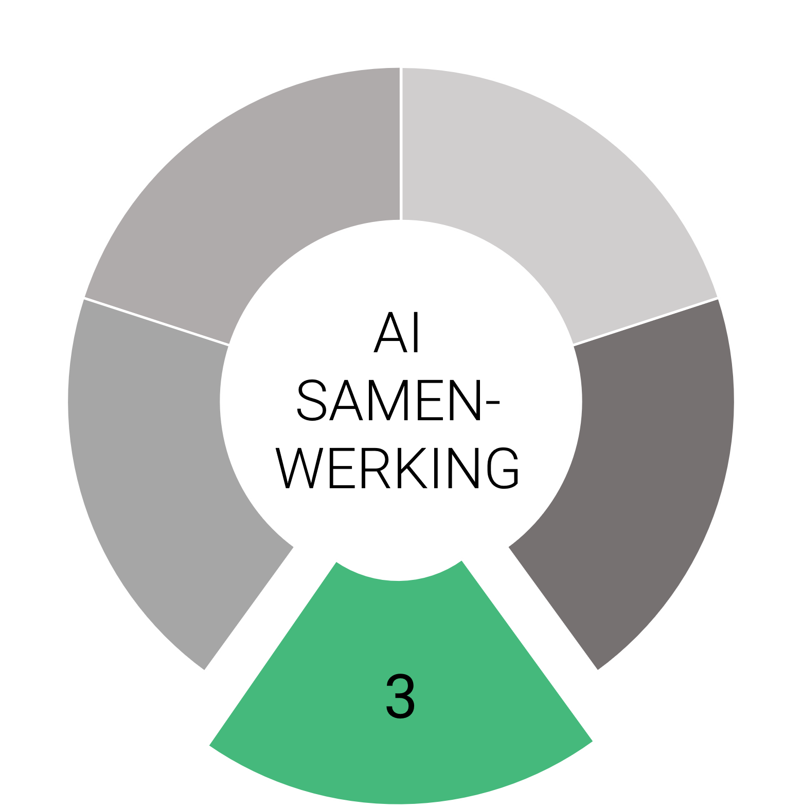

# ICT-CSE-IAC

Repo voor content Infrastructure as Code lessen.

Opzet & randvoorwaarden (geldt voor alle opdrachten):

Repo lay-out voorbeeld (te gebruiken vanaf week 2):

```
/infra/
  terraform/
    azure/
    esxi/
    modules/
  ansible/
    inventories/
      prod/
        hosts.ini
        group_vars/
          all/
            vault.yml   # ansible-vault encrypted
    roles/
      common/
      web/
      monitoring/
  docs/
.github/workflows/ci.yml
.pre-commit-config.yaml
```

Git workflow:
Werk per opdracht op een nieuwe feature branch, open een PR naar main.
Vereist: minimaal 1 review op elke PR (peer review op klasgenoot) met kort checklist-comment.
Merge via PR merge (geen direct pushes naar main).

Secrets:
Bij de opdracht van week 6 gebruik je geen hardcoded wachtwoorden meer in je code.

AI gebruik:
Je mag AI gebruiken om specifieke taken te ondersteunen, zoals het opstellen, verfijnen en evalueren van je werk.
Je moet AI-gegenereerde inhoud die je gebruikt kritisch evalueren en aanpassen. Dit moet terug te vinden zijn in je repository in de vorm van een reflectie en/of mondeling toegelicht kunnen worden. Ga daarbij niet alleen in op wat je gedaan hebt, maar ook waarom en welke keuzes je gemaakt hebt.

