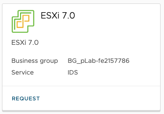
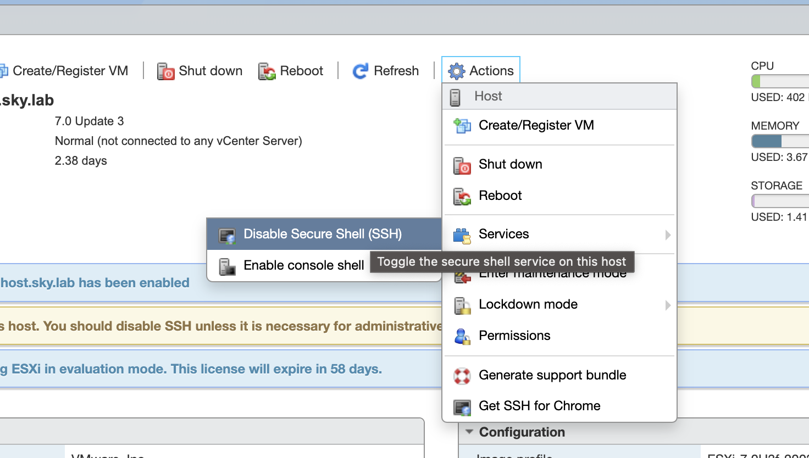
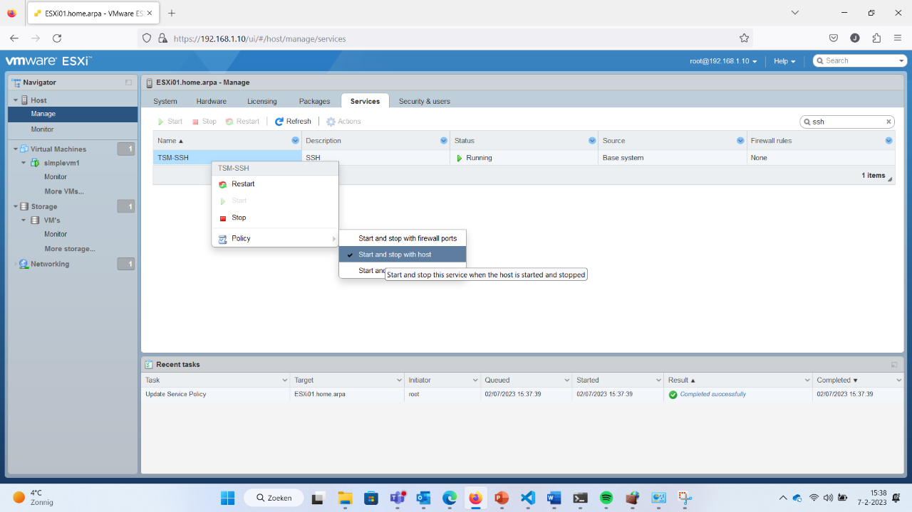

### LAB

##### Ontwikkelomgeving (opdracht 1)

- VPN naar Skylab pfsense is vereist.
- Ontwikkel en commando omgeving (Ubuntu VM) in Skylab
- VSCode of andere editor op lokale machine
- We werken niet met de remote console van Skylab maar alleen via een Terminal. Dit is een knock out voor je beoordeling!

##### ESXi (opdracht 2)

Om de opdrachten uit te kunnen voeren heb je ook een ESXi omgeving nodig op Skylab. Deploy deze met default instellingen, 16GB ram + 50gb extra storage disk toekennen



Log daarna in op de ESXi console met username **root** en wachtwoord **Welkom01!**
Daarna moet SSH toegang aan worden gezet via **Actions>Services>SSH**



Via **Manage->Services** kun je SSH altijd laten opstarten, zodat je dit niet elke keer hoeft te doen.



Maak als laatste een nieuwe datastore aan op je toegevoegde disk in ESXI. Noem deze **datastore1**

##### ESXi (opdracht 3)

Als ESXi gedeployed is voer je vanaf je ontwikkel omgeving het volgende commando uit:

```bash
ansible -i 'IPADRESESXI,' -m ping all -u root -k
```

Een screenshot van de ping lever je in op Brightspace.
